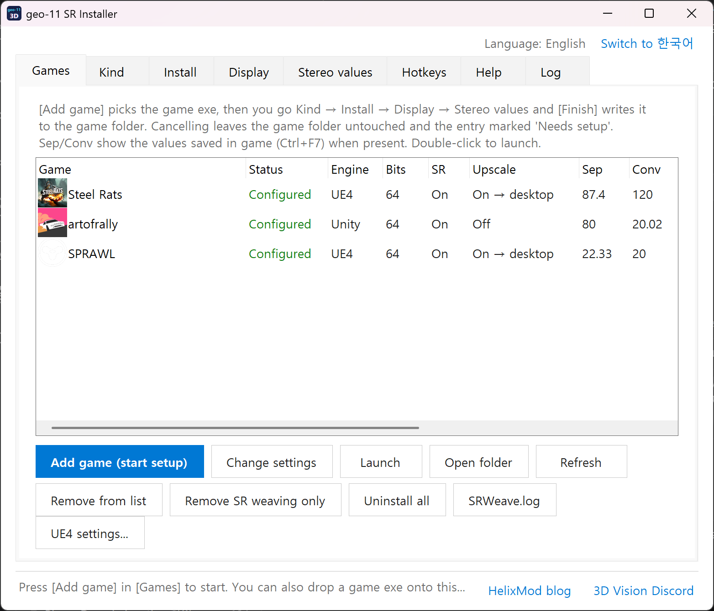

# geo-11 SR

[English](README.md) · **한국어**

geo-11은 3DMigoto 기반의 입체 3D 드라이버로, 게임을 좌우(SBS) 화면으로 그립니다. 이 프로젝트는 여기에 **SRWeave**를 더합니다. 게임의 진짜 `IDXGISwapChain::Present`를 후킹해 그 SBS 프레임을 SR SDK 위버로 바로 엮어, Acer SpatialLabs나 Leia SR 같은 무안경(렌티큘러) 패널에 보여 주는 작은 `dxgi.dll`입니다. ReShade도 GameBridge도 필요 없습니다. 64비트·32비트 게임을 모두 지원합니다.

**SR 패널이 없어도 쓸 수 있습니다.** SR 위빙을 끄면 일반 geo-11 설치기로 동작해 다른 3D 디스플레이(SBS, 상하, 인터레이스 출력)에 그대로 씁니다.



## 받기와 설치

[Releases](../../releases)에서 **`geo-11_SR_all-in-one.zip`** 하나를 받아 아무 곳에나 풉니다. 설치기와 세 픽스 패키지가 하위 폴더로 들어 있고, 설치기가 기대하는 배치 그대로입니다:

```
geo-11_SR\
  Installer\Geo11SRInstaller.exe
  Geo-11_Unity\
  Geo-11_DX11\
  Geo-11_UE4\
```

| 폴더 | 내용 |
|---|---|
| `Installer\` | GUI 설치기(한국어 / 영어)와 한국어 설명서 |
| `Geo-11_Unity\` | Unity Universal Fix + geo-11 0.6.109 + SRWeave (x64, x32) |
| `Geo-11_DX11\` | 일반 geo-11 "Preferred" + SRWeave (x64, x32) |
| `Geo-11_UE4\` | Unreal Engine 4 Universal Fix 2 (Win11판) + SRWeave, 64비트 전용. geo-11은 0.6.109로 올렸고 원본 0.6.40은 `ShaderFixes\Geo11_0.6.40`에 보관 |

폴더들은 나란히 두세요. 설치기가 패키지를 상대 경로로 찾습니다.

## 미리 필요한 것

| 항목 | 필요 여부 |
|---|---|
| SR 패널 + SR 런타임 | SR 위빙을 쓸 때만 필요합니다. Acer SpatialLabs 제품은 **SpatialLabs Experience Center**만 설치하면 됩니다. 64비트 런타임(`C:\Program Files\Acer\SpatialLabs\Platform\bin`), 32비트 런타임(`C:\Program Files (x86)\Simulated Reality\Platform\bin`), SR Service가 함께 설치됩니다. 다른 Leia SR 패널은 그 제품의 SR Platform 런타임을 설치하세요. SR 위빙을 끄면 SR 관련 설치는 전혀 필요 없습니다. |
| Visual C++ 재배포 패키지 | SRWeave와 설치기에는 필요 없습니다(정적 링크). geo-11(3DMigoto 계열)은 VC++ 2015~2022 x64(32비트 게임이면 x86도)를 쓰는데, 거의 모든 게임이 이미 설치해 둡니다. |
| .NET Framework 4.x | 설치기용. Windows 10/11에 4.8이 기본 포함되어 있습니다. |
| GPU | 제한 없음. geo-11은 NVIDIA 3D Vision 없이 동작하며 패키지의 `nvapi64.dll`은 대체본입니다. |
| Visual Studio, CMake | 소스를 직접 빌드할 때만 필요합니다. |

게임은 패널의 원래 해상도(예: 3840×2160)로 전체화면 또는 테두리 없는 창에서 실행해야 렌티큘러 무늬가 맞습니다.

## 설치기 사용법

1. **게임 목록** 탭 → **게임 추가** → 게임 exe 선택.
2. **종류**: geo-11(Unity 픽스 / 일반) 또는 Unreal Engine 4 Universal Fix 2. 실행 파일 구조로 자동 감지되며 바꿀 수 있습니다.
3. **설치**: 비트, Unity 버전, 기존 픽스, 전체 설치 또는 "SR 위빙만 추가".
4. **디스플레이**: SR 위빙 켬/끔, 좌우 눈 바꾸기, 렌즈, 업스케일. SR 위빙을 끄면 3D 출력 모드(sbs / tab / 인터레이스 등) 선택.
5. **입체 값**: Separation, Convergence, 자동 수렴. **완료**를 누르면 게임 폴더에 모두 적용됩니다.

단축키(**단축키** 탭에서 변경): Ctrl+F3/F4 Separation, Ctrl+F5/F6 Convergence, Ctrl+F7 저장, Ctrl+T 3D 켬/끔, 숫자패드 0 오버레이. SRWeave: Ctrl+Alt+W 위빙 켬/끔, Ctrl+Alt+S 좌우 눈 바꾸기, Ctrl+Alt+L 렌즈, Ctrl+Alt+T 테스트 무늬.

UE4 Universal Fix 2 게임은 `-dx11` 인자로 실행해야 합니다. 설치기가 Steam 시작 옵션(Steam을 잠시 종료했다가 다시 시작)이나 Heroic의 게임 설정(Epic/GOG)에 넣어 줍니다. Epic Games Launcher로 직접 실행하면 런처의 실행 인자에 `-dx11`을 직접 넣으세요. **UE4 설정** 창이 픽스의 명령창 설정 도구를 대신합니다(AA/AO 개선, 강제 전체화면, VSync, HUD 프로필).

문제가 있으면 게임 폴더의 `SRWeave.log`를 보세요. 자세한 설명은 [`Installer/README_KR.md`](Installer/README_KR.md)에 있습니다.

## 저장소 구성

| 폴더 | 내용 |
|---|---|
| [`Installer/`](Installer/) | GUI 설치기(C# WinForms, 콘솔 창 없음, 한국어 / 영어). 소스 `src\*.cs`, 빌드 `src\build.cmd`(Roslyn csc). 설명서 [`README_KR.md`](Installer/README_KR.md) |
| [`SRWeave/`](SRWeave/) | SRWeave `dxgi.dll` 소스(C++, MinHook, SR SDK). `build.ps1 -Arch all` → `bin\x64\dxgi.dll`, `bin\x86\dxgi.dll`. 설명 [`README.md`](SRWeave/README.md) |

픽스 패키지는 저장소에 없고(제3자 저작물, 용량) 릴리스 첨부로만 제공합니다.

## SRWeave 동작

1. 첫 `CreateDXGIFactory*` 호출 때 진짜 팩토리의 `CreateSwapChain` / `CreateSwapChainForHwnd`를 MinHook으로 후킹합니다.
2. 게임이 스왑체인을 만들면 진짜 `Present` / `Present1` / `ResizeBuffers`를 후킹합니다. geo-11이 SBS 프레임을 다 그린 뒤 Present 안에서 위버가 돕니다.
3. SR DLL은 지연 로드라 SR 런타임이 없으면 위빙만 꺼집니다. sRGB 백버퍼(TYPELESS 복사)와 32비트 게임(dxgi 서수 차이, `dxgi32.def`)도 처리합니다.
4. 단축키와 옵션은 `SRWeave.ini`, 로그는 그 옆의 `SRWeave.log`입니다.

## 빌드

- 설치기: `Installer\src\build.cmd` (Visual Studio의 Roslyn csc, 없으면 .NET Framework 4 csc). 외부 라이브러리 없음.
- SRWeave: `SRWeave\build.ps1 -Arch all` (CMake + MSVC). SR SDK는 포함되어 있지 않습니다. SR Platform 설치본(또는 Leia/SR SDK)에서 가져와 `CMakeLists.txt`의 `SR_SDK` 옵션으로 경로를 주세요.

## 검증 (2026-10-09)

- Unreal Engine 4 (Steel Rats, SPRAWL): 플레이, 입체 값 저장 키.
- Unity (art of rally): 위빙(sRGB 백버퍼 포함).
- x64·x86: D3D11 테스트 프로그램에서 훅 → SR 컨텍스트 → 위버 → 위빙 프레임.

## 출처와 라이선스

- **geo-11** — geo-11 팀(DarkStarSword, bo3b, masterotaku 등, 3DMigoto 계보), 3D Vision 커뮤니티 / [HelixMod](https://helixmod.blogspot.com/).
- **Unity Universal Fix**(Unity_Complete)와 **geo-11 Preferred** — GameBridge와 함께 배포되는 패키지.
- **Unreal Engine 4 Universal Fix 2** — LOSTI 제작(helixmod 커뮤니티). 이 프로젝트는 SRWeave 파일, 새 geo-11, ini 몇 줄(저장 키, `-dx11`)만 더했고 원래 설정 도구는 패키지에 그대로 있습니다.
- **SR SDK / SR Platform** — Leia Inc. / Acer SpatialLabs (포함되지 않음, 설치된 런타임에서 로드).
- **MinHook** — Tsuda Kageyu, BSD 2-Clause (`SRWeave/third_party/minhook`).

이 저장소의 코드(설치기, SRWeave)는 MIT 라이선스입니다(`LICENSE`). 릴리스의 패키지는 각 제작자의 것이며 SR 패널 사용자의 편의를 위해 재배포합니다. 제작자가 내리길 원하면 이슈로 알려 주세요.

커뮤니티: [3D Vision Discord](https://discord.gg/zTnnMrA4GE) · [HelixMod](https://helixmod.blogspot.com/)
