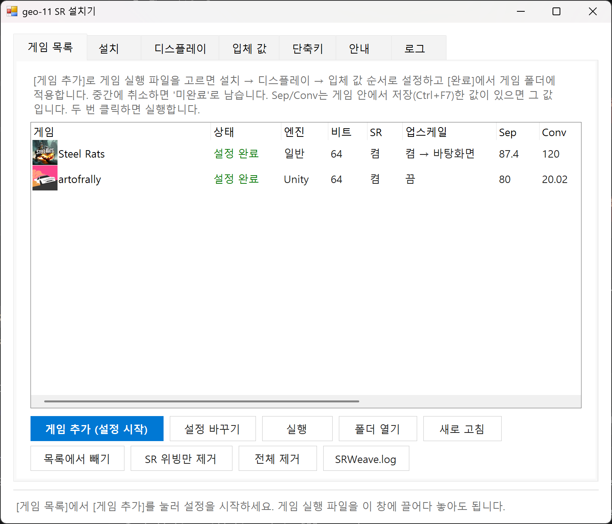

# geo-11 SR — geo-11 + SR display weaving (no ReShade)

**English summary.** geo-11 (a 3DMigoto-based stereo 3D driver) renders games side-by-side. SRWeave is a small
`dxgi.dll` that hooks the game's real `IDXGISwapChain::Present` and weaves that SBS frame for a lenticular
(glasses-free) SR panel — Acer SpatialLabs / Leia SR — using the SR SDK's `IDX11Weaver1` directly, so no ReShade
and no GameBridge are needed. The repository holds the SRWeave source (x64 + x86), a Windows GUI installer that
sets up a game in a few steps (Unity Universal Fix, generic geo-11 "Preferred", or Unreal Engine 4 Universal Fix 2),
and Korean/English documentation. The ready-made fix packages with the SR files added are attached to the
[Releases](../../releases) as zips; they contain third-party work (see *Credits*).

geo-11의 SBS 출력을 게임 안에서 SR SDK 위버(`IDX11Weaver1`)로 바로 위빙하는 패키지 모음입니다.
ReShade·GameBridge 없이 SRWeave `dxgi.dll` 하나로 동작하고, 64비트·32비트 게임을 모두 지원합니다.



## 받기 / Download

[Releases](../../releases)에서 받습니다. 설치기와 패키지 폴더는 **같은 위치**에 풀어야 합니다
(설치기가 `..\geo-11 v0.6.109_*_SR\x64|x32`, `..\UNREAL_Engine_4_UNIVERSAL-FIX_2_SR`를 상대 경로로 찾습니다).

```
어떤폴더\
  geo-11_SR_Installer\Geo11SRInstaller.exe
  geo-11 v0.6.109_Unity_Complete_SR\
  geo-11 v0.6.109_Preferred_SR\
  UNREAL_Engine_4_UNIVERSAL-FIX_2_SR\
```

| 릴리스 파일 | 내용 |
|---|---|
| `Geo11SRInstaller.zip` | GUI 설치기 exe + 한국어 설명서 |
| `geo-11_v0.6.109_Unity_Complete_SR.zip` | Unity Universal Fix + geo-11 0.6.109 + SRWeave (x64, x32) |
| `geo-11_v0.6.109_Preferred_SR.zip` | 일반 geo-11 Preferred + SRWeave (x64, x32) |
| `UNREAL_Engine_4_UNIVERSAL-FIX_2_SR.zip` | Unreal Engine 4 Universal Fix 2 (Win11판) + SRWeave, 64비트 전용. geo-11은 0.6.109로 교체(원본 0.6.40은 `ShaderFixes\Geo11_0.6.40`) |

실행 조건: SR 런타임(SpatialLabs / SR Platform)이 설치돼 있고 SR Service가 실행 중이어야 위빙됩니다. 없으면 게임은 SBS 그대로 정상 실행됩니다.
게임은 SR 패널에서 패널 원래 해상도로 전체화면 또는 테두리 없는 창으로 실행하세요.

## 저장소 구성

| 폴더 | 내용 |
|---|---|
| [`geo-11_SR_Installer/`](geo-11_SR_Installer/) | **GUI 설치기** (WinForms, 콘솔 창 없음, 한국어/영어). 게임 목록 → 종류(geo-11 Unity/일반 ↔ UE4 UF2) → 설치 → 디스플레이 → 입체 값 → 완료. 단축키 편집, 업스케일, UE4 설정 창(AA/AO·전체화면·VSync·HUD 프로필), Steam/Heroic에 `-dx11` 시작 옵션 넣기. 자세한 설명은 [`README_KR.md`](geo-11_SR_Installer/README_KR.md). 소스 `src\*.cs`, 빌드 `src\build.cmd`(Roslyn csc) |
| [`SRWeave_Geo11/`](SRWeave_Geo11/) | SRWeave `dxgi.dll` **소스** (C++ / MinHook / SR SDK). `build.ps1 -Arch all` → `bin\x64\dxgi.dll`, `bin\x86\dxgi.dll`. 설명은 [`README.md`](SRWeave_Geo11/README.md) |

패키지 폴더 자체는 저장소에 없고 릴리스 첨부로만 제공합니다(제3자 저작물, 용량).

## SRWeave 요약

1. 첫 `CreateDXGIFactory*` 호출 때 진짜 dxgi 팩토리의 `CreateSwapChain` / `CreateSwapChainForHwnd`를 MinHook으로 후킹합니다.
2. 게임이 스왑체인을 만들면 진짜 `Present` / `Present1` / `ResizeBuffers`를 후킹하고, geo-11이 SBS를 다 그린 뒤 Present 안에서 SR 위버로 위빙합니다.
3. SR DLL은 지연 로드라 SR 런타임이 없으면 위빙만 꺼집니다. sRGB 백버퍼(TYPELESS 복사), 32비트(dxgi 서수 차이, `dxgi32.def`)도 처리합니다.
4. 단축키(기본 Ctrl+Alt + W/S/L/T: 위빙 켬끔 / 좌우 눈 바꾸기 / 렌즈 켬끔 / 테스트 무늬)는 `SRWeave.ini`에서 바꿉니다. 로그는 게임 폴더의 `SRWeave.log`.

## 빌드

- 설치기: `geo-11_SR_Installer\src\build.cmd` (Visual Studio의 Roslyn csc, 없으면 .NET Framework 4 csc). 외부 라이브러리 없음.
- SRWeave: `SRWeave_Geo11\build.ps1 -Arch all` (CMake + MSVC). SR SDK는 포함되어 있지 않습니다 — SR Platform 설치본(또는 Leia/SR SDK)에서 가져와 `CMakeLists.txt`의 `SR_SDK` 옵션으로 경로를 주세요.

## 검증 상태 (2026-10-09)

- UE4 게임(Steel Rats, SPRAWL)에서 실제 플레이, 입체 값 저장(Ctrl+F7) 확인.
- Unity 게임(art of rally)에서 위빙 확인(sRGB 백버퍼 수정 포함).
- 32비트·64비트 모두 D3D11 테스트 프로그램으로 훅 → SR 컨텍스트 → 위버 → 위빙 프레임 확인.

## Credits / 출처

- **geo-11** — the geo-11 team (DarkStarSword, bo3b, masterotaku and others; 3DMigoto lineage). Packages from the 3D Vision community / [HelixMod](https://helixmod.blogspot.com/).
- **Unity Universal Fix** (Unity_Complete) and **geo-11 Preferred** packages — as distributed with GameBridge.
- **Unreal Engine 4 Universal Fix 2** — assembled by LOSTI (helixmod community). This repository only adds SRWeave files, a newer geo-11 and a few ini lines (save key, `-dx11` handling); the original config tool is kept in the package.
- **SR SDK / SR Platform** — Leia Inc. / Acer SpatialLabs (not included; loaded from the installed runtime).
- **MinHook** — Tsuda Kageyu, BSD 2-Clause (`SRWeave_Geo11/third_party/minhook`).

Code in this repository (installer, SRWeave) is MIT licensed (see `LICENSE`). The third-party packages in the releases belong to their authors; redistribution here is for convenience of SR panel users — tell me if you own one of them and want it removed.

Community: [3D Vision Discord](https://discord.gg/zTnnMrA4GE) · [HelixMod](https://helixmod.blogspot.com/)
